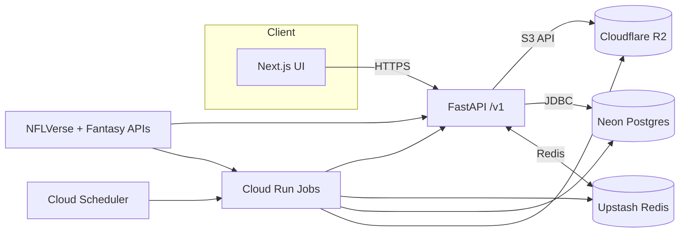

# System Architecture

## Overview
- Frontend: Next.js 14 on Cloudflare Pages. SSR via Pages Functions where needed.
- Backend: FastAPI on Google Cloud Run. Autoscale. Private egress to Neon.
- Workers: Cloud Run Jobs for ETL, training, backtests, projections.
- DB: Neon Postgres. Branch per env.
- Cache/Queue: Upstash Redis for caching, queues, pub/sub.
- Object Storage: Cloudflare R2 for Parquet artifacts, models, and exports.
- Scheduler: Google Cloud Scheduler → Cloud Run Jobs.
- Secrets: Google Secret Manager.
- Observability: OpenTelemetry traces + metrics. GCP Cloud Logging and OTLP sink.

## Data Flow (Mermaid)

