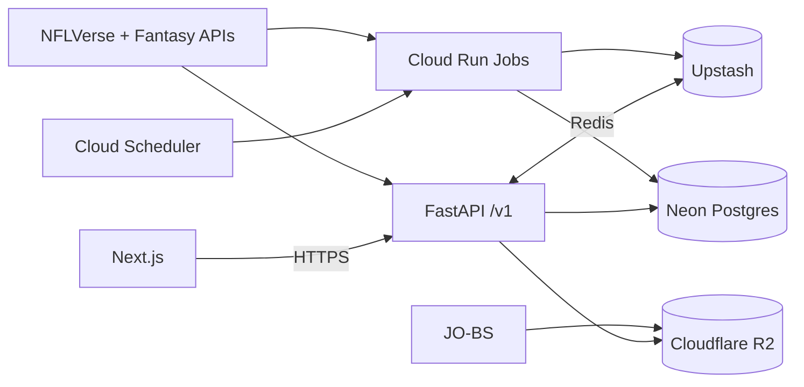

# GridIron Sherlock

**GridIron Sherlock** is a cross-provider, analytics-driven fantasy football companion that links to a user’s league, computes advanced metrics and projections, and optimizes roster decisions with explainable recommendations. Our vision is to help you detect hidden edges faster than your opponents and provide precise, explainable advice.

## Core Features

*   **Unified Analytics:** Connects to Yahoo, ESPN, Sleeper, and NFL.com fantasy leagues, unifying data into a single, powerful model.
*   **Advanced Projections:** Delivers calibrated weekly and rest-of-season (ROS) projections with uncertainty estimates, giving you a true sense of potential outcomes.
*   **Decision Optimization:**
    *   **Lineup Optimizer:** Recommends the optimal starting lineup based on your goals, constraints, and risk tolerance.
    *   **Waiver & Free Agent Recommendations:** Identifies the best players to add to your roster and provides FAAB bidding advice.
    *   **Trade Analysis:** Evaluates trade proposals for fairness and potential impact on your team's performance.
*   **Live Game Impact:** Streams live updates during games, showing the real-time impact of plays on your matchup and projections.
*   **Deep Research Tools:** Provides access to in-depth data and analytics for power users who want to dig deeper.

## Architecture Overview

GridIron Sherlock is built on a modern, scalable, and serverless architecture:

*   **Frontend:** [Next.js](https://nextjs.org/) on [Cloudflare Pages](https://pages.cloudflare.com/)
*   **Backend:** [FastAPI](https://fastapi.tiangolo.com/) on [Google Cloud Run](https://cloud.google.com/run)
*   **Database:** [Neon Postgres](https://neon.tech/)
*   **Cache & Queue:** [Upstash Redis](https://upstash.com/)
*   **Data & Models:** [Cloudflare R2](https://www.cloudflare.com/products/r2/) for data artifacts and machine learning models.
*   **Data Source:** Primarily powered by the [nflverse](https://nflverse.nflverse.com/) data.

## Project Specification

This repository contains the complete design and specification for the GridIron Sherlock application. For a detailed breakdown of the project's architecture, data models, features, and operational plans, please see the documents in the [`/docs`](/docs) directory, starting with the [Overall Specification](docs/GRIDIRON_SHERLOCK_OVERALL_SPEC.md).