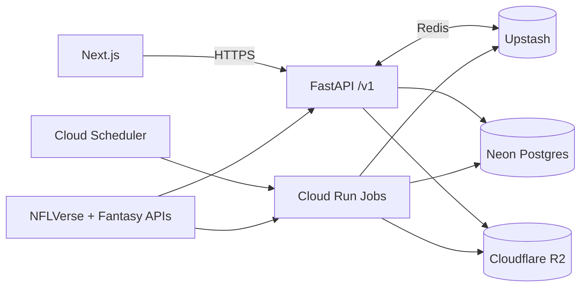

# GridIron Sherlock — Overall Specification
Date: 2025-10-24

## 0. Purpose
Define the vision and full structure of GridIron Sherlock: a cross‑provider, analytics‑driven fantasy‑football companion that links to a user’s league, computes advanced metrics and projections, and optimizes roster decisions with explainable recommendations.

## 1. Vision and Objectives
- Vision: Detect hidden edges faster than opponents. Provide precise, explainable advice.
- Objectives
  - Unify NFLVerse and fantasy providers into one normalized model.
  - Deliver calibrated weekly and ROS projections with uncertainty.
  - Optimize lineups, waivers, and trades with constraints and risk controls.
  - Stream live impacts during games.
  - Maintain provenance, repeatability, and low cost.

## 2. Core Value
- Data depth equal to power users, presented as clear actions.
- Explanations for every suggestion.
- Works with Yahoo, ESPN, Sleeper, or NFL at runtime.

## 3. Target Users and Jobs-to-be-Done
- Manager: Link league, get weekly start/sit, waivers, trades.
- Power user: Deep research, custom filters, exports.
- Commissioner: League-wide health and parity insights (optional).

## 4. Scope
- In: projections, optimizer, waivers, trades, matchup analysis, live impacts, research tools.
- Out (v1): DFS, betting, private tracking data, manual stat edits.

## 5. Non-Functional Requirements
- p95 API ≤ 500 ms on cached data. p95 page interactive ≤ 1.5 s.
- Availability ≥ 99.9% in season weeks.
- Transparent provenance. Reproducible data builds.
- Read-only scopes by default. PII minimization.

## 6. Architecture (High Level)
- Frontend: Next.js 14 on Cloudflare Pages (SSR with Pages Functions).
- Backend: FastAPI on Google Cloud Run. Autoscale. Private egress to Neon.
- Workers: Cloud Run Jobs for ETL, features, training, backtests, projections.
- DB: Neon Postgres (branch per env).
- Cache/Queue: Upstash Redis for caching, rate limits, pub/sub.
- Object Storage: Cloudflare R2 for Parquet artifacts and model binaries.
- Scheduler: Google Cloud Scheduler → Cloud Run Jobs.
- Secrets: Google Secret Manager.
- Observability: OpenTelemetry traces + metrics.

 
## 7. Data Sources and Precedence
- NFLfastR: play-by-play, rates, EPA, WP, CPOE (field events truth).
- NFLreadR: rosters, depth charts, injuries, transactions.
- NFL4th: fourth‑down and WP models.
- NFLseedR: season simulation utilities.
- PyESPN: ESPN fantasy structures; provider SDKs for Yahoo/Sleeper/NFL.
- Precedence
  - Fantasy roster state: provider.
  - On-field performance: NFLfastR.
  - Injury/availability: NFLreadR, then provider notes.
- ID normalization
  - Canonical player key: gsis_id. Crosswalk tables map Yahoo/ESPN/Sleeper/NFL IDs.

## 8. Domain Model (Summary)
- Users, user_accounts, providers.
- Leagues, teams.
- Players, games, pbp (Parquet primary), injuries.
- Features (wide numeric per player‑week), projections (mean, p20, p50, p80…), optimizer_runs, recommendations.
- Indexes for (season, week, pos), (gsis_id), (league_id, provider_team_id).

## 9. Pipelines and Orchestration
- Reference sync: players, team IDs, crosswalks (weekly).
- Schedules/games: preseason bulk, weekly refresh, game‑day hourly.
- PBP ingest: nflfastR → R2 Parquet. Incremental during live. Post‑game finalize.
- Injuries: nflreadr + provider notes (daily + on‑demand).
- Fantasy state: leagues/rosters/waivers/matchups (hourly in season + manual refresh).
- Idempotent upserts with source_etag and manifests. Fail on schema drift.

## 10. Feature Engineering (Player‑Week)
- Usage: snap_share, route_share, target_share, rush_share, rz_share, g2g_share, ldd_snaps.
- Efficiency: yprr, aDOT, RACR, epa_per_target, epa_per_rush, success_rate.
- Context: pace, PROE, totals, spread, home/away.
- Defense vs position: epa allowed, explosive rate, pressure rate.
- Volatility: stdev, CV, p25/p75.
- Regression: xTD−TD, QB xINT−INT.
- Windows: last 1/3/5, season‑to‑date, role deltas.
- Execution: DuckDB compute → Postgres persist. Strict validation.

## 11. Modeling
- Targets: weekly fantasy points under league scoring. Separate per position.
- Mean model: gradient boosted trees.
- Uncertainty: quantile models for p20/p50/p80, boom/bust probabilities.
- ROS: decay‑weighted with role deltas and injury modifiers.
- Calibration: isotonic per position.
- Registry: R2 models/<version>/ + DB record. Reproducible signatures.
- Metrics: MAE, CRPS/pinball, calibration by decile. Backtests 2019–2023, validate 2024, rolling 2025.

## 12. Optimizer
- Solver: OR‑Tools MIP.
- Objective: maximize mean + λ·ceiling − μ·variance.
- Constraints: roster slots, positional limits, injury/bye locks, max players per NFL team (optional).
- Output: optimal lineup, top‑k alternatives, sensitivity deltas with explanations.

## 13. Recommendation Engines
- Start/Sit: optimizer deltas plus confidence.
- Waivers/FAAB: projected points above replacement next N weeks × scarcity. Low/med/high FAAB bands.
- Trades: ROS delta for both sides vs replacement. Playoff weighting. Injury risk discount. Fairness band ±5%.

## 14. Live Impact Engine
- Ingest cadence: 15–30 s incremental PBP when available. Fallback to scoreboard deltas.
- Normalize events. Publish to Redis live:v1. SSE /v1/live/stream to clients.
- Idempotency key: game_id:play_id.

## 15. API (REST + SSE)
- Version: /v1.
- Auth: session cookie for UI, service tokens for jobs.
- Key routes
  - POST /accounts/{{provider}}/link and GET /oauth/{{provider}}/callback
  - GET /leagues, GET /leagues/{{id}}
  - GET /teams/{{id}}/lineup, POST /teams/{{id}}/optimize
  - GET /projections, GET /players, GET /players/{{id}}
  - GET /waivers, POST /trades/estimate
  - GET /live/stream
  - POST /refresh/{{scope}}
- Errors: {{error:{{code,message,details}}}}. Rate limits via Redis.

## 16. UI Information Architecture
- Left rail: Dashboard, Lineup, Matchup, Waivers, Trades, Players, Projections, Research, Live, Settings.
- Top bar: global search, last refresh, source badge.
- Key screens
  - Dashboard: health, matchup difficulty, start/sit changes, waiver snapshot, trade radar, trends.
  - Lineup Optimizer: objective sliders, roster grid with quantiles, one‑click apply, explanation drawer.
  - Matchup: environment, positional battles, startability matrix.
  - Waivers: filters, value table, FAAB bands, multi‑add planner.
  - Trades: needs matrix, generated proposals, fairness score, risk panel.
  - Players Index/Detail: role, efficiency, matchup, projections with intervals, SHAP explain.
  - Research: query builder on NFLfastR/readR, chart templates, saved studies.
  - Live: real‑time tiles, impact feed, rapid what‑if swaps.
  - Settings: account linking, scoring overrides, notifications.
- Provenance chips on metrics. Drilldowns and compare mode. WCAG AA.

## 17. Caching and Performance
- Redis keys: proj:{{league}}:{{week}}, player:{{id}}, team:{{id}}:lineup, waivers:{{league}}:{{week}}.
- TTLs: projections 15 min Tue–Sat, 5 min Sun–Mon; fantasy state 2 min in live windows.
- HTTP ETag + stale‑while‑revalidate 60 s. Table virtualization and chart downsampling.

## 18. Security and Compliance
- OAuth with PKCE where supported. Read‑only scopes by default.
- AES‑GCM encryption for tokens at rest. Rotation and revocation flows.
- PII minimization. Audit log for auth, syncs, recommendations served.
- Secrets only via Google Secret Manager.

## 19. Observability
- OpenTelemetry traces, metrics, and logs. Red, yellow, green data freshness indicators.
- Health checks for API, workers, Redis, DB, and R2.
- Alerts on error spikes, queue backlog, data quality failures.

## 20. Cost and Scaling
- Cloud Run min instances 0. Concurrency 80 for API, 1 for jobs.
- Neon autoscaling and PR branches.
- Upstash serverless tiers. Monitor R2 egress.
- Cache hit target ≥ 85% on projections and players.

## 21. Environments and CI/CD
- Envs: dev, staging, prod with isolated Neon branches and Redis DBs.
- GitHub Actions: build → test → scan → deploy with approvals.
- Blue/green for API. Cloudflare Pages previews for PRs.
- Migrations: Alembic. Gate deploy on success.

## 22. Configuration
- Required variables: see 17_ENV_VARS.md in SPEC.zip.
- Feature flags in Redis. Kill‑switch for models and live feed.

## 23. Testing and Quality
- Unit: adapters, feature builders, scoring mappers.
- Integration: provider cassettes or sandboxes; DB migrations on branches.
- Data quality: dbt‑style tests for keys, nulls, ranges.
- Backtests: weekly scheduled; fail on regression thresholds.
- E2E: Playwright on link → sync → optimize → waivers → trades → live.

## 24. Acceptance Criteria
- Link one provider and sync leagues/rosters ≤ 60 s.
- Projections available for current week with p20/p50/p80 for all rostered players.
- Optimizer returns result with explanation ≤ 2 s p95 on cached data.
- Waiver and trade suggestions with documented deltas and replacement logic.
- Live impacts stream during games with no duplicates.
- Every metric displays provenance and last refresh.

## 25. Rollout Plan
- Alpha: ESPN only, start/sit + projections, manual refresh.
- Beta: add Yahoo/Sleeper, waivers, trades, live impacts.
- GA: research lab, ROS sims, advanced optimizer knobs, canary model releases.

## 26. Risks and Mitigations
- Provider rate limits → caching, backoff, circuit breakers.
- ID mismatches → versioned crosswalks with audits.
- Model drift → backtests and calibration checks each release.
- Cost spikes → strict TTLs, minimal min‑instances, artifacts in R2.
- Live data gaps → scoreboard fallback and graceful degradation.

## 27. Glossary
- EPA: Expected Points Added.
- PROE: Pass Rate Over Expected.
- WOPR: Weighted Opportunity Rating.
- ROS: Rest‑of‑Season.
- SHAP: Shapley Additive Explanations.

## 28. References
- NFLVerse: https://nflverse.nflverse.com/index.html
- NFLreadR: https://nflreadr.nflverse.com/index.html
- NFLfastR: https://nflfastr.com/index.html
- NFLplotR: https://nflplotr.nflverse.com/
- NFL4th: https://www.nfl4th.com/index.html
- NFLseedR: https://nflseedr.com/index.html
- PyESPN: https://enderlocke.github.io/pyespn/
